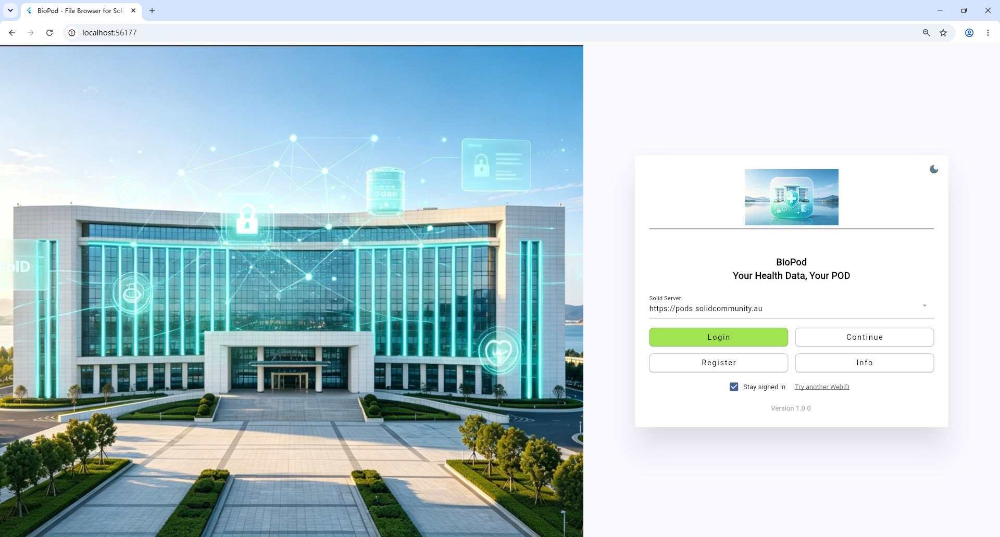
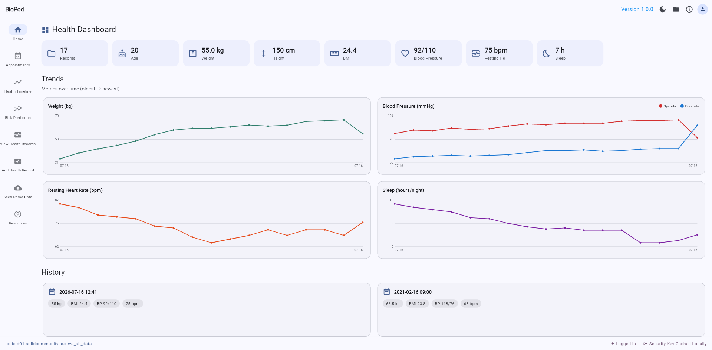
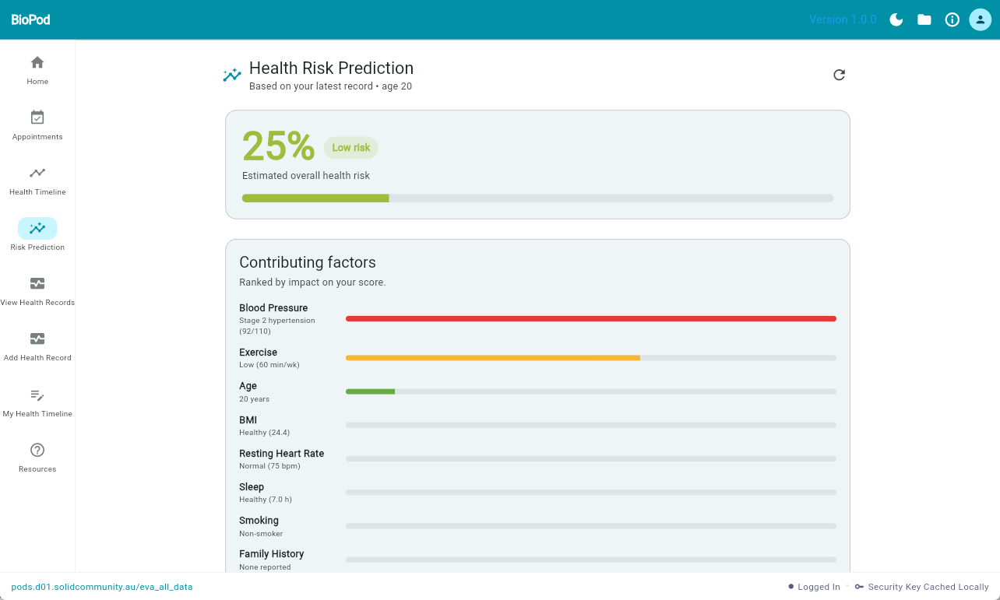
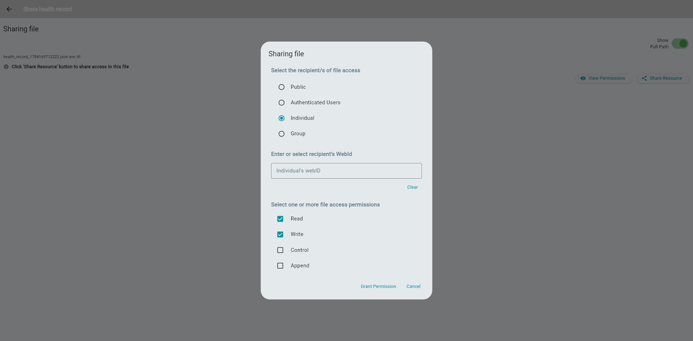

# MedicalApp
# 🧬 BioPod 

## 📖 Project Summary

**BioPod** is a Flutter-based health application designed to empower users with true data ownership. Instead of relying on centralized servers, BioPod stores user health data directly within their personal **Solid Pod**. 

Our application bridges the gap between daily health tracking and clinical record management, all while ensuring absolute data privacy and user-controlled sharing.

### ✨ Key Features:
* 📊 **Daily Health Tracking & Analytics:** Users can record daily metrics including weight, blood pressure, heart rate, and sleep. The app automatically calculates BMI, visualizes trend graphs, and provides a **0–100 risk score** benchmarked against a reference population dataset.
* 🏥 **Clinical Data Management:** Beyond routine metrics, BioPod supports the logging of clinical data during illness, such as blood test results. Users can input this data manually or upload files directly to their Pod.
* 🔐 **Decentralized Access Control:** Leveraging genuine Solid access control mechanisms (WAC/ACP), users can securely share specific records with external parties (e.g., healthcare providers) via their WebID. Users can grant view-only or modification permissions, and instantly revoke authorization at any time.

---

## 📸 App Walkthrough

*(A quick look at the BioPod experience)*

### 1. Secure Decentralized Login
Users authenticate using their own Solid Pod provider. No central database holds their credentials.

  

### 2. Comprehensive Health Dashboard
All data is fetched directly from the user's Pod, visualizing metrics like BMI, Blood Pressure, and Sleep trends over time.

  

### 3. Smart Risk Prediction
Based on the stored records, BioPod calculates a health risk score and compares the user's data against a reference cohort dataset.

  

### 4. True Data Ownership & Access Control
Users can share specific health records with doctors by entering their WebID, granting precise Read/Write permissions via Solid's native access control.

  

---

## 🚀 How to Use the Demo

We invite the judges to test our live web app prototype. Follow these simple steps to experience BioPod:

1. **Open the Live Demo:** Navigate to [https://eva0628.github.io/MedicalApp/](https://eva0628.github.io/MedicalApp/)
2. **Install the Web App (Recommended):** For the best experience, click the **install popup** that appears in the **top-right corner** of your browser's address bar to install BioPod as a web app. This ensures the app runs correctly and the Pod authentication redirect works smoothly.
3. **Launch App:** Tap **Login** on the welcome screen.
4. **Provider Details:** Enter your Solid Pod provider address (e.g., `https://pods.solidcommunity.au`) and tap **Continue**.
5. **Authentication:** Enter your Pod email and password on the login page that opens.
6. **Authorization:** Tap **Authorize** (or *Consent*) to allow BioPod to access your Pod.
7. **Start Tracking:** You will be redirected back into the app. You are now securely signed in and ready to add or view health records directly from your Pod!

> ⚠️ **Note on Empty Dashboards:** BioPod reads and writes data **directly from your own Solid Pod** — we do not host any of your data on a central server. When you first sign in, your Pod contains no health records yet, so the dashboard, trends, and risk prediction screens will appear **blank**. Please **add a few health records first** (via the *Add Record* screen), and the dashboard and analytics will populate automatically.

---

## 🛠 Built With
* **Frontend:** Flutter (Web)
* **Backend/Data Storage:** Solid Pods (Decentralized storage)
* **Security:** WAC / ACP (Web Access Control)

---
*Created with ❤️ for SOLID Hackathon 2026*
